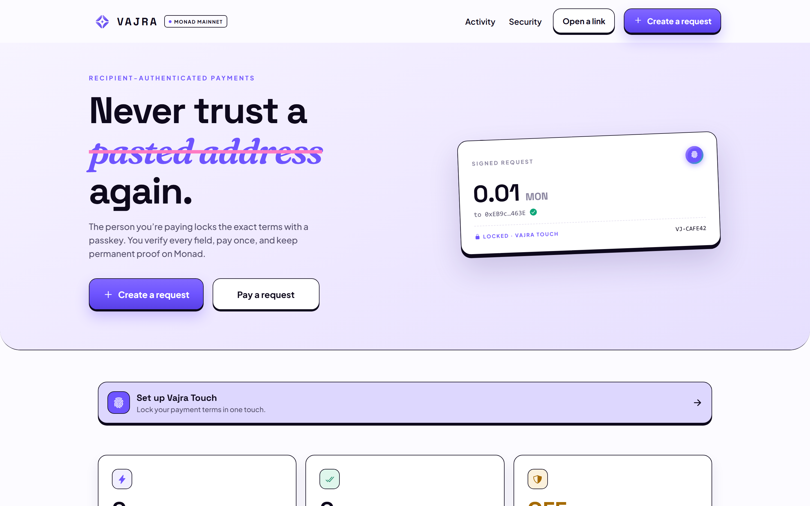
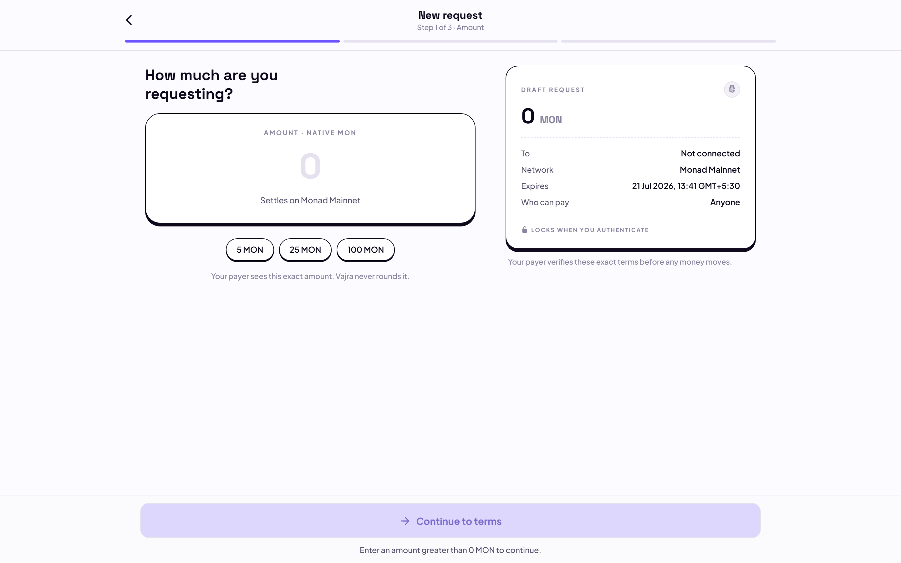
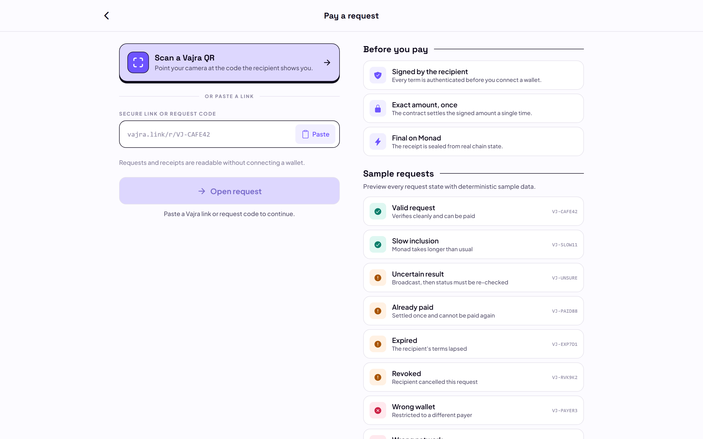
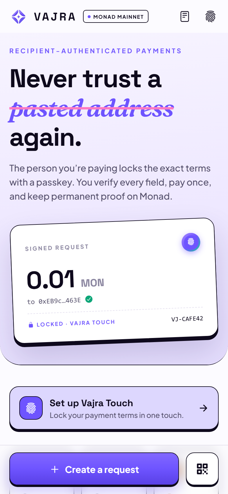
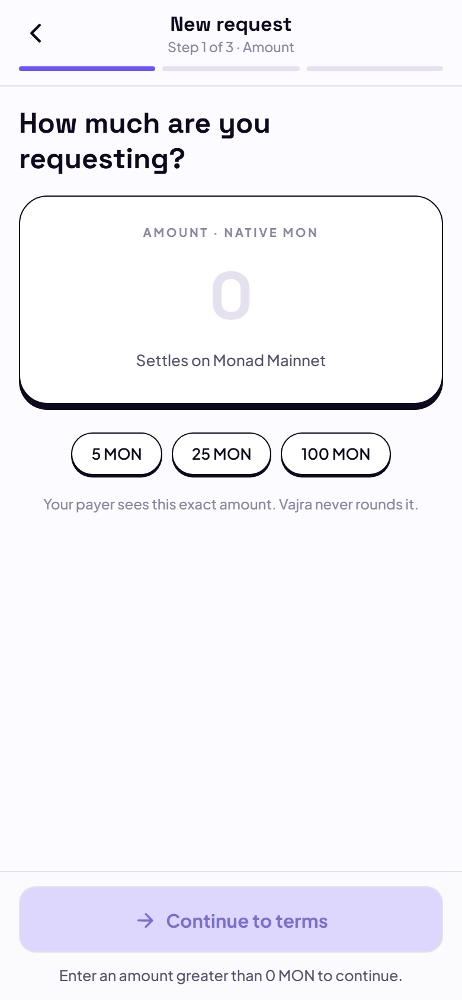

# Vajra

**Verified payments on Monad.** Signed by them. Final on Monad.

Vajra is a recipient-authenticated payment protocol. A recipient creates exact
payment terms — amount, recipient, expiry, optional payer — and signs them with
their wallet (EIP-712) or a registered device passkey (WebAuthn/P-256, verified
onchain). The sender opens the link, verifies every term before connecting a
wallet, and pays the exact amount once. The first valid payment settles
atomically onchain; every later attempt reverts at contract level.

No custody. No admin keys. No backend. The contract holds no balances — a
successful payment moves native MON directly to the signed recipient.

## App preview



<table>
  <tr>
    <td></td>
    <td></td>
  </tr>
</table>

<p align="center">
  
  &nbsp;&nbsp;
  
</p>

## Live deployment

| | |
|---|---|
| Network | Monad Mainnet (chain ID 143) |
| Contract | [`0x7d17f2765bb58ceb27b9e1e52b068c72ccb8299f`](https://monadscan.com/address/0x7d17f2765bb58ceb27b9e1e52b068c72ccb8299f) |
| Verification | Sourcify full match (creation + runtime), mirrored on Monadscan |
| Deploy tx | `0xf8f3ca3e…6495` |
| Smoke tests | register / pay / duplicate-rejection / revoke — all real mainnet transactions, see `docs/log.md` |

## Repository layout

```
frontend/          Expo (React Native + web) app — the entire user experience
  app/             Screens: create, open-link, pay, progress, receipt, share,
                   activity, passkey-setup, security
  src/components/  Design system components (buttons, sheets, stage rail, toast)
  src/lib/web3/    Chain config, typed contract client, EIP-712 hashing,
                   payload codec, finality tracking, passkey (WebAuthn), errors
contracts/         Foundry project — VajraNativeV1.sol
  test/            98 tests: unit, fuzz, invariant, ERC-1271, WebAuthn fixture,
                   EIP-712 parity vectors
docs/              Blueprint, design system, decision log, research
```

## How it works

1. **Create** — the recipient enters amount, expiry, memo, and an optional
   exact payer. The app builds the canonical request and the wallet signs it
   as EIP-712 typed data (domain: chain 143 + the Vajra contract). No
   transaction, no gas.
2. **Share** — the signed terms travel as a base64url payload in the link
   fragment (or QR). The fragment is never sent to any server.
3. **Verify** — the sender's app strictly decodes the payload and calls
   `inspect()` on the contract. Every term is readable before a wallet is
   connected. Any mutation of a signed field fails verification.
4. **Pay** — `fulfill(request, proof)` with exactly `msg.value == amount`.
   Checks-effects-interactions, reentrancy-guarded, state written before the
   native transfer; a failed transfer reverts everything.
5. **Seal** — the receipt is rendered only after the transaction receipt, the
   `PaymentFulfilled` event, and the contract state all agree.

## Quickstart

```bash
# Contracts
cd contracts
forge build
forge test        # 98 passing

# App (web)
cd frontend
npm install
npx expo export --platform web   # production build → dist/
npx expo start --web             # local dev
```

The app is mainnet-only and fails closed: it reads the canonical contract
address and chain ID from `src/lib/web3/chain.ts` and refuses any other
domain. There is no testnet fallback, no mock mode, and no demo data on the
payment path. The "Sample requests" section on the pay-entry screen renders
deterministic *previews* of every request state and is labeled as such.

## Security model

- **Immutable contract** — no owner, no upgrade, no pause, no fee, no admin
  withdrawal, no user balances, no arbitrary external calls.
- **Domain separation** — every request binds chain ID 143 and the contract
  address; signatures cannot be replayed elsewhere.
- **Single-use settlement** — status transitions are one-way; a paid request
  can never be unpaid or revoked, a revoked request can never be paid.
- **Passkey authority is scoped** — a registered passkey can only authenticate
  incoming payment requests to its own wallet. It cannot spend.
- **Version invalidation** — rotating or deactivating a passkey invalidates
  every unpaid request signed by older key versions.
- **Honest UI** — success requires receipt + event + state. Optimistic UI is
  forbidden on anything that moves funds.

## Testing

| Suite | Count | Result |
|---|---|---|
| Contract unit / revert | 60+ | passing |
| Fuzz (amounts, timestamps, values) | 256 runs | passing |
| Invariant (terminality, conservation) | 32 runs × 1024 calls | passing |
| EIP-712 TS↔Solidity parity vectors | 8 frozen | passing |
| WebAuthn/P-256 fixture | included | passing |
| Mainnet smoke (real txs) | 4 | passing |

## License

MIT — see [LICENSE](LICENSE).
